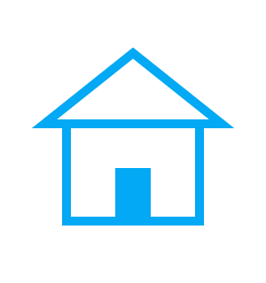
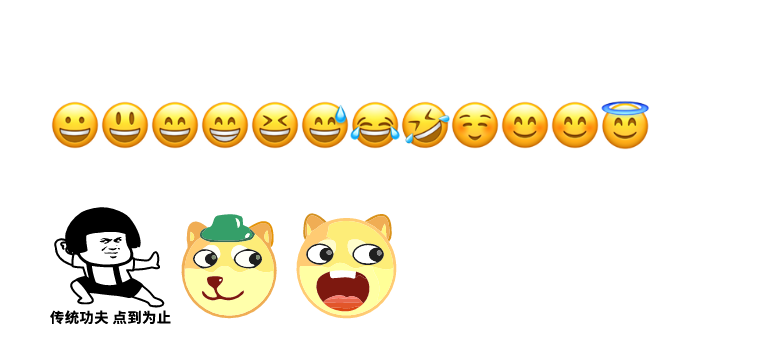
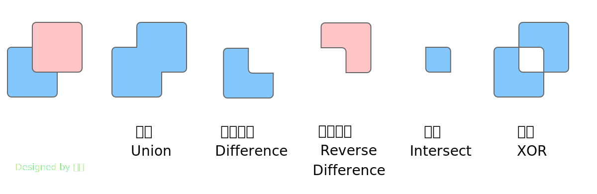
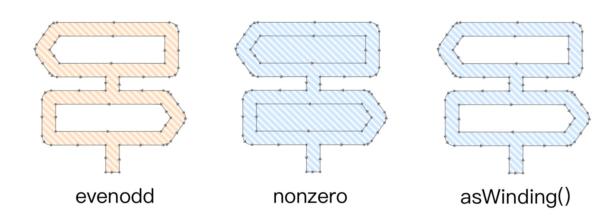
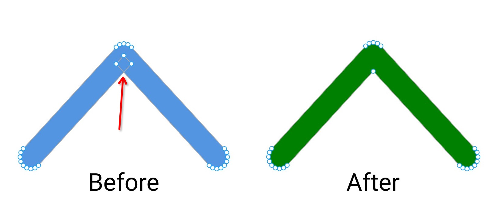
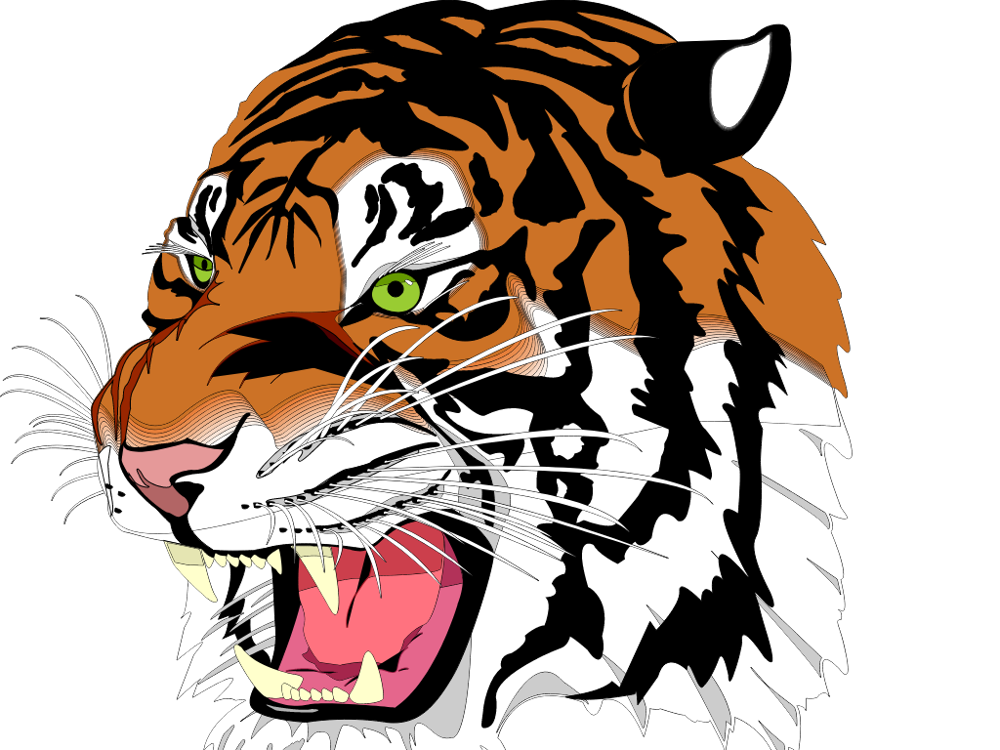

# `skr canvas`


[](https://packagephobia.com/result?p=@napi-rs/canvas)
[](https://npmcharts.com/compare/@napi-rs/canvas?minimal=true)

> 🚀 帮助我成为全职开源开发者: [Sponsoring me on Github](https://github.com/sponsors/Brooooooklyn)

通过 [Node-API](https://napi.rs) 将 Google Skia 绑定到 Node.js。 **零系统依赖**。

> ⚠️ 这个项目还处于预发布阶段，可能会存在一些 Bug。<br/>
> 在这里可以找到此项目的具体开发计划和路线图 [Roadmap](https://github.com/Brooooooklyn/canvas/issues/113)。

[English](./README.md)

# 安装

```bash
yarn add @napi-rs/canvas
npm install @napi-rs/canvas
```

# 支持的系统和 Node.js 版本

## 系统要求

### `arm64`

**Linux** 需要 [**_cortex-a57_**](https://en.wikipedia.org/wiki/ARM_Cortex-A57) 或更新的 CPU 架构。

**macOS** 上支持所有 Apple M 系列芯片。

### `armv7`

[**_cortex-a7_**](https://en.wikipedia.org/wiki/ARM_Cortex-A7) 或更新的 CPU 架构。

### glibc

由于 Skia 依赖 [glibc](https://www.gnu.org/software/libc/) 2.18 的 API，所以最少需要您的系统中 glibc 版本 >= 2.18。

# 用法

```js
const { promises } = require('node:fs')
const { join } = require('node:path')
const { createCanvas } = require('@napi-rs/canvas')

const canvas = createCanvas(300, 320)
const ctx = canvas.getContext('2d')

ctx.lineWidth = 10
ctx.strokeStyle = '#03a9f4'
ctx.fillStyle = '#03a9f4'

// 墙
ctx.strokeRect(75, 140, 150, 110)

// 门
ctx.fillRect(130, 190, 40, 60)

// 屋顶
ctx.beginPath()
ctx.moveTo(50, 140)
ctx.lineTo(150, 60)
ctx.lineTo(250, 140)
ctx.closePath()
ctx.stroke()

async function main() {
  const pngData = await canvas.encode('png') // 也支持 JPEG 、AVIF 和 WebP
  // encoding in libuv thread pool, non-blocking
  await promises.writeFile(join(__dirname, 'simple.png'), pngData)
}

main()
```



## Emoji 文字

```js
const { writeFileSync } = require('fs')
const { join } = require('path')

const { createCanvas, GlobalFonts } = require('@napi-rs/canvas')

GlobalFonts.registerFromPath(join(__dirname, '..', 'fonts', 'AppleColorEmoji@2x.ttf'), 'Apple Emoji')
GlobalFonts.registerFromPath(join(__dirname, '..', '__test__', 'fonts', 'COLRv1.ttf'), 'COLRv1')

console.info(GlobalFonts.families)

const canvas = createCanvas(760, 360)
const ctx = canvas.getContext('2d')

ctx.font = '50px Apple Emoji'
ctx.strokeText('😀😃😄😁😆😅😂🤣☺️😊😊😇', 50, 150)

ctx.font = '100px COLRv1'
ctx.fillText('abc', 50, 300)

const b = canvas.toBuffer('image/png')

writeFileSync(join(__dirname, 'draw-emoji.png'), b)
```



# 性能

[benchmark](./benchmark) 代码。

硬件信息:

```
OS: Windows 10 x86_64
Host: Micro-Star International Co., Ltd. MS-7C35
Kernel: 10.0.19043
Terminal: Windows Terminal
CPU: AMD Ryzen 9 5950X (32) @ 3.400GHz
Memory: 32688MiB
```

```
❯ yarn bench

> @napi-rs/canvas@0.0.9 bench D:\workspace\skia-rs
> node -r @swc-node/register benchmark/bench.ts

Running "Draw house" suite...
Progress: 100%

  skia-canvas:
    26 ops/s, ±0.70%   | slowest, 29.73% slower

  node-canvas:
    30 ops/s, ±6.95%   | 18.92% slower

  @napi-rs/canvas:
    37 ops/s, ±6.30%   | fastest

Finished 3 cases!
  Fastest: @napi-rs/canvas
  Slowest: skia-canvas
Running "Draw gradient" suite...
Progress: 100%

  skia-canvas:
    36 ops/s, ±6.12%   | 14.29% slower

  node-canvas:
    34 ops/s, ±5.60%   | slowest, 19.05% slower

  @napi-rs/canvas:
    42 ops/s, ±0.53%   | fastest

Finished 3 cases!
  Fastest: @napi-rs/canvas
  Slowest: node-canvas
```

# 功能

## Path2D

```typescript
new Path2D()
new Path2D(path: Path2D)
// new Path2D('M108.956,403.826c0,0,0.178,3.344-1.276,3.311  c-1.455-0.033-30.507-84.917-66.752-80.957C40.928,326.18,72.326,313.197,108.956,403.826z')
new Path2D(path: string)
```

```typescript
export interface DOMMatrix2D {
  a: number
  b: number
  c: number
  d: number
  e: number
  f: number
}

export class Path2D {
  constructor(path?: Path2D | string)

  addPath(path: Path2D, transform?: DOMMatrix2D): void
  arc(x: number, y: number, radius: number, startAngle: number, endAngle: number, anticlockwise?: boolean): void
  arcTo(x1: number, y1: number, x2: number, y2: number, radius: number): void
  bezierCurveTo(cp1x: number, cp1y: number, cp2x: number, cp2y: number, x: number, y: number): void
  closePath(): void
  ellipse(
    x: number,
    y: number,
    radiusX: number,
    radiusY: number,
    rotation: number,
    startAngle: number,
    endAngle: number,
    anticlockwise?: boolean,
  ): void
  lineTo(x: number, y: number): void
  moveTo(x: number, y: number): void
  quadraticCurveTo(cpx: number, cpy: number, x: number, y: number): void
  rect(x: number, y: number, w: number, h: number): void

  // PathKit methods
  op(path: Path2D, operation: PathOp): Path2D
  toSVGString(): string
  getFillType(): FillType
  getFillTypeString(): string
  setFillType(type: FillType): void
  simplify(): Path2D
  asWinding(): Path2D
  stroke(stroke?: StrokeOptions): Path2D
  transform(transform: DOMMatrix2D): Path2D
  getBounds(): [left: number, top: number, right: number, bottom: number]
  computeTightBounds(): [left: number, top: number, right: number, bottom: number]
  trim(start: number, end: number, isComplement?: boolean): Path2D
  equals(path: Path2D): boolean
}
```

## PathKit

PathKit 是 Skia 中用来操作 Path 的工具集，支持二次贝塞尔曲线（quadratic beziers）、三次贝塞尔曲线（cubic beziers）和圆锥形（conics）。
主要的功能有：

### 布尔运算

`.op(path, PathOp)`

```js
const pathOne = new Path2D(
  'M8 50H92C96.4183 50 100 53.5817 100 58V142C100 146.418 96.4183 150 92 150H8C3.58172 150 0 146.418 0 142V58C0 53.5817 3.58172 50 8 50Z',
)
const pathTwo = new Path2D(
  '"M58 0H142C146.418 0 150 3.58172 150 8V92C150 96.4183 146.418 100 142 100H58C53.5817 100 50 96.4183 50 92V8C50 3.58172 53.5817 0 58 0Z',
)

pathOne.op(pathTwo, PathOp.Intersect).toSVGString()
// => "M100 100L58 100C53.5817 100 50 96.4183 50 92L50 50L92 50C96.4183 50 100 53.5817 100 58L100 100Z"
```

- **Union** 联集（并集）
- **Difference** 减去顶层
- **ReverseDifference** 减去底层
- **Intersect** 交集
- **XOR** 差集



### 转换 **_Path_** 的 `FillType`

`.asWinding()`

可以把 SVG 中的 `fill-rule="evenodd"` 转换为 `fill-rule="nonzero"`，
这对 OpenType 字体相关工具非常有用，因为 OpenType 字体中只支持 `fill-rule="nonzero"`。



```js
const pathCircle = new Path2D(
  'M24.2979 13.6364H129.394V40.9091H24.2979L14.6278 27.2727L24.2979 13.6364ZM21.9592 0C19.0246 0 16.2716 1.42436 14.571 3.82251L1.67756 22.0043C-0.559186 25.1585 -0.559186 29.387 1.67756 32.5411L14.571 50.7227C16.2716 53.1209 19.0246 54.5455 21.9592 54.5455H70.4673V68.1818H16.073C11.0661 68.1818 7.00728 72.2518 7.00728 77.2727V113.636C7.00728 118.657 11.0661 122.727 16.073 122.727H70.4673V150H84.0658V122.727H128.041C130.975 122.727 133.729 121.303 135.429 118.905L148.323 100.723C150.559 97.5686 150.559 93.3405 148.323 90.1864L135.429 72.0045C133.729 69.6064 130.975 68.1818 128.041 68.1818H84.0658V54.5455H133.927C138.934 54.5455 142.993 50.4755 142.993 45.4545V9.09091C142.993 4.07014 138.934 0 133.927 0H21.9592ZM125.702 109.091H20.6058V81.8182H125.702L135.372 95.4545L125.702 109.091Z',
)
pathCircle.setFillType(FillType.EvenOdd)
pathCircle.asWinding().toSVGString()
// => "M24.2979 13.6364L129.394 13.6364L129.394 40.9091L24.2979 40.9091L14.6278 27.2727L24.2979 13.6364ZM21.9592 0C19.0246 0 16.2716 1.42436 14.571 3.82251L1.67756 22.0043C-0.559186 25.1585 -0.559186 29.387 1.67756 32.5411L14.571 50.7227C16.2716 53.1209 19.0246 54.5455 21.9592 54.5455L70.4673 54.5455L70.4673 68.1818L16.073 68.1818C11.0661 68.1818 7.00728 72.2518 7.00728 77.2727L7.00728 113.636C7.00728 118.657 11.0661 122.727 16.073 122.727L70.4673 122.727L70.4673 150L84.0658 150L84.0658 122.727L128.041 122.727C130.975 122.727 133.729 121.303 135.429 118.905L148.323 100.723C150.559 97.5686 150.559 93.3405 148.323 90.1864L135.429 72.0045C133.729 69.6064 130.975 68.1818 128.041 68.1818L84.0658 68.1818L84.0658 54.5455L133.927 54.5455C138.934 54.5455 142.993 50.4755 142.993 45.4545L142.993 9.09091C142.993 4.07014 138.934 0 133.927 0L21.9592 0ZM125.702 109.091L20.6058 109.091L20.6058 81.8182L125.702 81.8182L135.372 95.4545L125.702 109.091Z"
```

### 简化 **_Path_**

`.simplify()`

将路径设置为与原路径区域相同的非重叠轮廓（non-overlapping），也就是说它还可以移除重叠路径。



[带有重叠路径的 SVG](./docs/imgs/overlapping-path.svg)（左侧）

```js
const path =
  'M2.933,89.89 L89.005,3.818 Q90.412,2.411 92.249,1.65 Q94.087,0.889 96.076,0.889 Q98.065,0.889 99.903,1.65 Q101.741,2.411 103.147,3.818 L189.22,89.89 Q190.626,91.296 191.387,93.134 Q192.148,94.972 192.148,96.961 Q192.148,98.95 191.387,100.788 Q190.626,102.625 189.219,104.032 Q187.813,105.439 185.975,106.2 Q184.138,106.961 182.148,106.961 Q180.159,106.961 178.322,106.2 Q176.484,105.439 175.077,104.032 L89.005,17.96 L96.076,10.889 L103.147,17.96 L17.075,104.032 Q15.668,105.439 13.831,106.2 Q11.993,106.961 10.004,106.961 Q8.015,106.961 6.177,106.2 Q4.339,105.439 2.933,104.032 Q1.526,102.625 0.765,100.788 Q0.004,98.95 0.004,96.961 Q0.004,94.972 0.765,93.134 Q1.526,91.296 2.933,89.89 Z'

path.simplify().toSVGString()
// => "M89.005 3.818L2.933 89.89Q1.526 91.296 0.765 93.134Q0.004 94.972 0.004 96.961Q0.004 98.95 0.765 100.788Q1.526 102.625 2.933 104.032Q4.339 105.439 6.177 106.2Q8.015 106.961 10.004 106.961Q11.993 106.961 13.831 106.2Q15.668 105.439 17.075 104.032L96.076 25.031L175.077 104.032Q176.484 105.439 178.322 106.2Q180.159 106.961 182.148 106.961Q184.138 106.961 185.975 106.2Q187.813 105.439 189.219 104.032Q190.626 102.625 191.387 100.788Q192.148 98.95 192.148 96.961Q192.148 94.972 191.387 93.134Q190.626 91.296 189.22 89.89L103.147 3.818Q101.741 2.411 99.903 1.65Q98.065 0.889 96.076 0.889Q94.087 0.889 92.249 1.65Q90.412 2.411 89.005 3.818Z"
```

# [Example](./example/tiger.js)

> The tiger.json was serialized from [gojs/samples/tiger](https://github.com/NorthwoodsSoftware/GoJS/blob/master/samples/tiger.html)



```shell
node example/anime-girl.js
```

| SVG                                            | PNG                                            |
| ---------------------------------------------- | ---------------------------------------------- |
|  |  |

# 编译项目

## 从源码编译

你可以从源码编译此项目，无需安装任何额外的系统依赖:

```sh
# Clone the code:
$ git clone --recurse-submodules https://github.com/Brooooooklyn/canvas.git
$ cd canvas

# Build Skia:
$ node scripts/build-skia.js

# Install NPM packages, build the Node.js addon:
$ yarn install --ignore-scripts
$ yarn build

# All done! Run test cases or examples now:
$ yarn test
$ node example/tiger.js
```

## 从 GitHub 上下载预编译的 `skia` 二进制

如果你只关心项目的 `Rust` 部分，可以下载预编译的 `skia` 二进制静态链接文件:

```sh
# Clone the code:
$ git clone --recurse-submodules https://github.com/Brooooooklyn/canvas.git
$ cd canvas

# Download Skia binaries:
# It will pull the binaries match the git hash in `./skia` submodule
$ node scripts/release-skia-binary.mjs --download

# Install NPM packages, build the Node.js addon:
$ yarn install --ignore-scripts
$ yarn build

# All done! Run test cases or examples now:
$ yarn test
$ node example/tiger.js
```
