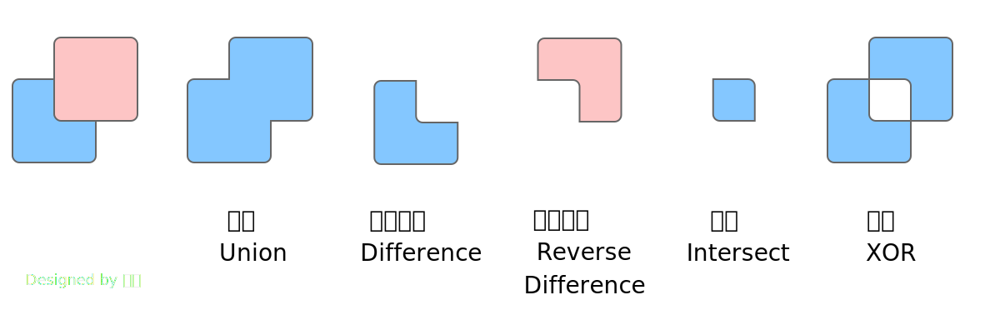
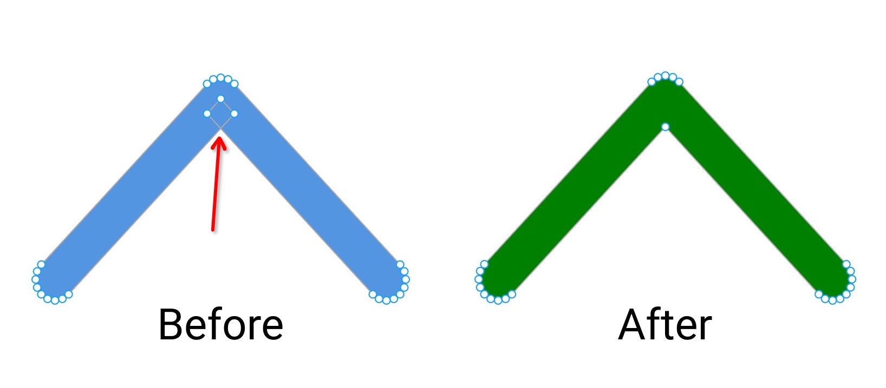

# `skr canvas`


> 🚀 帮助我成为全职开源开发者: [Sponsoring me on Github](https://github.com/sponsors/Brooooooklyn)

通过 [Node-API](https://napi.rs) 将 Google Skia 绑定到 Node.js。 **零系统依赖**。

> ⚠️ 这个项目还处于早期开发阶段。<br/>
> 在这里可以找到此项目的具体开发计划和路线图 [Roadmap](https://github.com/Brooooooklyn/canvas/issues/113)。

[中文文档](./README-zh.md)

# 安装

```bash
yarn add @napi-rs/canvas
npm install @napi-rs/canvas
```

# 支持的系统和 Node.js 版本

|                       | node10 | node12 | node14 | node16 |
| --------------------- | ------ | ------ | ------ | ------ |
| Windows x64           | ✓      | ✓      | ✓      | ✓      |
| macOS x64             | ✓      | ✓      | ✓      | ✓      |
| macOS aarch64         | ✓      | ✓      | ✓      | ✓      |
| Linux x64 gnu         | ✓      | ✓      | ✓      | ✓      |
| Linux x64 musl        | ✓      | ✓      | ✓      | ✓      |
| Linux aarch64 gnu     | ✓      | ✓      | ✓      | ✓      |
| Linux aarch64 musl    | ✓      | ✓      | ✓      | ✓      |
| Linux arm gnueabihf   | ✓      | ✓      | ✓      | ✓      |
| Linux aarch64 android | ✓      | ✓      | ✓      | ✓      |

# 用法

```js
const { promises } = require('fs')
const { join } = require('path')
const { createCanvas } = require('@napi-rs/canvas')

const canvas = createCanvas(300, 320)
const ctx = canvas.getContext('2d')

ctx.lineWidth = 10
ctx.strokeStyle = '#03a9f4'
ctx.fillStyle = '#03a9f4'

// 墙
ctx.strokeRect(75, 140, 150, 110)

// 门
ctx.fillRect(130, 190, 40, 60)

// 屋顶
ctx.beginPath()
ctx.moveTo(50, 140)
ctx.lineTo(150, 60)
ctx.lineTo(250, 140)
ctx.closePath()
ctx.stroke()

async function main() {
  const pngData = await canvas.encode('png') // 也支持 JPEG 和 WebP
  // encoding in libuv thread pool, non-blocking
  await promises.writeFile(join(__dirname, 'simple.png'), pngData)
}

main()
```


# 性能

[benchmark](./benchmark) 代码.

硬件信息:

```
OS: Windows 10 x86_64
Host: Micro-Star International Co., Ltd. MS-7C35
Kernel: 10.0.19043
Terminal: Windows Terminal
CPU: AMD Ryzen 9 5950X (32) @ 3.400GHz
Memory: 32688MiB
```

```
❯ pnpm bench

> @napi-rs/canvas@0.0.9 bench D:\workspace\skia-rs
> node -r @swc-node/register benchmark/bench.ts

Running "Draw house" suite...
Progress: 100%

  skia-canvas:
    26 ops/s, ±0.70%   | slowest, 29.73% slower

  node-canvas:
    30 ops/s, ±6.95%   | 18.92% slower

  @napi-rs/skia:
    37 ops/s, ±6.30%   | fastest

Finished 3 cases!
  Fastest: @napi-rs/skia
  Slowest: skia-canvas
Running "Draw gradient" suite...
Progress: 100%

  skia-canvas:
    36 ops/s, ±6.12%   | 14.29% slower

  node-canvas:
    34 ops/s, ±5.60%   | slowest, 19.05% slower

  @napi-rs/skia:
    42 ops/s, ±0.53%   | fastest

Finished 3 cases!
  Fastest: @napi-rs/skia
  Slowest: node-canvas
```

# 功能

## Path2D

```typescript
new Path2D()
new Path2D(path: Path2D)
// new Path2D('M108.956,403.826c0,0,0.178,3.344-1.276,3.311  c-1.455-0.033-30.507-84.917-66.752-80.957C40.928,326.18,72.326,313.197,108.956,403.826z')
new Path2D(path: string)
```

```typescript
export interface DOMMatrix2DInit {
  a: number
  b: number
  c: number
  d: number
  e: number
  f: number
}

export class Path2D {
  constructor(path?: Path2D | string)

  addPath(path: Path2D, transform?: DOMMatrix2DInit): void
  arc(x: number, y: number, radius: number, startAngle: number, endAngle: number, anticlockwise?: boolean): void
  arcTo(x1: number, y1: number, x2: number, y2: number, radius: number): void
  bezierCurveTo(cp1x: number, cp1y: number, cp2x: number, cp2y: number, x: number, y: number): void
  closePath(): void
  ellipse(
    x: number,
    y: number,
    radiusX: number,
    radiusY: number,
    rotation: number,
    startAngle: number,
    endAngle: number,
    anticlockwise?: boolean,
  ): void
  lineTo(x: number, y: number): void
  moveTo(x: number, y: number): void
  quadraticCurveTo(cpx: number, cpy: number, x: number, y: number): void
  rect(x: number, y: number, w: number, h: number): void

  // PathKit methods
  op(path: Path2D, operation: PathOp): Path2D
  toSVGString(): string
  getFillType(): FillType
  getFillTypeString(): string
  setFillType(type: FillType): void
  simplify(): Path2D
  asWinding(): Path2D
  stroke(stroke?: StrokeOptions): Path2D
  transform(transform: DOMMatrix2DInit): Path2D
  getBounds(): [left: number, top: number, right: number, bottom: number]
  computeTightBounds(): [left: number, top: number, right: number, bottom: number]
  trim(start: number, end: number, isComplement?: boolean): Path2D
  equals(path: Path2D): boolean
}
```

## PathKit

PathKit 是 Skia 中用来操作 Path 的工具集，支持二次贝塞尔曲线（quadratic beziers）、三次贝塞尔曲线（cubic beziers）和圆锥形（conics）。
主要的功能有：

### 布尔运算

`.op(path, PathOp)`

```js
const pathOne = new Path2D(
  'M8 50H92C96.4183 50 100 53.5817 100 58V142C100 146.418 96.4183 150 92 150H8C3.58172 150 0 146.418 0 142V58C0 53.5817 3.58172 50 8 50Z',
)
const pathTwo = new Path2D(
  '"M58 0H142C146.418 0 150 3.58172 150 8V92C150 96.4183 146.418 100 142 100H58C53.5817 100 50 96.4183 50 92V8C50 3.58172 53.5817 0 58 0Z',
)

pathOne.op(pathTwo, PathOp.Intersect).toSVGString()
// => "M100 100L58 100C53.5817 100 50 96.4183 50 92L50 50L92 50C96.4183 50 100 53.5817 100 58L100 100Z"
```

- **Union** 联集（并集）
- **Difference** 减去顶层
- **ReverseDifference** 减去底层
- **Intersect** 交集
- **XOR** 差集



### 转换 **_Path_** 的 `FillType`

`.asWinding()`

可以把 SVG 中的 `fill-rule="evenodd"` 转换为 `fill-rule="nonzero"`，
这对 OpenType 字体相关工具非常有用，因为 OpenType 字体中只支持 `fill-rule="nonzero"`。

```js
const pathCircle = new Path2D(
  'M50 87.5776C70.7536 87.5776 87.5776 70.7536 87.5776 50C87.5776 29.2464 70.7536 12.4224 50 12.4224C29.2464 12.4224 12.4224 29.2464 12.4224 50C12.4224 70.7536 29.2464 87.5776 50 87.5776ZM50 100C77.6142 100 100 77.6142 100 50C100 22.3858 77.6142 0 50 0C22.3858 0 0 22.3858 0 50C0 77.6142 22.3858 100 50 100Z',
)
pathCircle.setFillType(FillType.EvenOdd)
pathCircle.asWinding().toSVGString()
// => "M50 87.5776C29.2464 87.5776 12.4224 70.7536 12.4224 50C12.4224 29.2464 29.2464 12.4224 50 12.4224C70.7536 12.4224 87.5776 29.2464 87.5776 50C87.5776 70.7536 70.7536 87.5776 50 87.5776ZM50 100C77.6142 100 100 77.6142 100 50C100 22.3858 77.6142 0 50 0C22.3858 0 0 22.3858 0 50C0 77.6142 22.3858 100 50 100Z"
```

### 简化 **_Path_**

`.simplify()`

将路径设置为与原路径区域相同的非重叠轮廓（non-overlapping），也就是说它还可以移除重叠路径。



[带有重叠路径的 SVG](./docs/imgs/overlapping-path.svg)（左侧）

```js
const path =
  'M2.933,89.89 L89.005,3.818 Q90.412,2.411 92.249,1.65 Q94.087,0.889 96.076,0.889 Q98.065,0.889 99.903,1.65 Q101.741,2.411 103.147,3.818 L189.22,89.89 Q190.626,91.296 191.387,93.134 Q192.148,94.972 192.148,96.961 Q192.148,98.95 191.387,100.788 Q190.626,102.625 189.219,104.032 Q187.813,105.439 185.975,106.2 Q184.138,106.961 182.148,106.961 Q180.159,106.961 178.322,106.2 Q176.484,105.439 175.077,104.032 L89.005,17.96 L96.076,10.889 L103.147,17.96 L17.075,104.032 Q15.668,105.439 13.831,106.2 Q11.993,106.961 10.004,106.961 Q8.015,106.961 6.177,106.2 Q4.339,105.439 2.933,104.032 Q1.526,102.625 0.765,100.788 Q0.004,98.95 0.004,96.961 Q0.004,94.972 0.765,93.134 Q1.526,91.296 2.933,89.89 Z'

path.simplify().toSVGString()
// => "M89.005 3.818L2.933 89.89Q1.526 91.296 0.765 93.134Q0.004 94.972 0.004 96.961Q0.004 98.95 0.765 100.788Q1.526 102.625 2.933 104.032Q4.339 105.439 6.177 106.2Q8.015 106.961 10.004 106.961Q11.993 106.961 13.831 106.2Q15.668 105.439 17.075 104.032L96.076 25.031L175.077 104.032Q176.484 105.439 178.322 106.2Q180.159 106.961 182.148 106.961Q184.138 106.961 185.975 106.2Q187.813 105.439 189.219 104.032Q190.626 102.625 191.387 100.788Q192.148 98.95 192.148 96.961Q192.148 94.972 191.387 93.134Q190.626 91.296 189.22 89.89L103.147 3.818Q101.741 2.411 99.903 1.65Q98.065 0.889 96.076 0.889Q94.087 0.889 92.249 1.65Q90.412 2.411 89.005 3.818Z"
```

# [Example](./example/tiger.js)

> The tiger.json was serialized from [gojs/samples/tiger](https://github.com/NorthwoodsSoftware/GoJS/blob/master/samples/tiger.html)


# 编译项目

## 从源码编译

你可以从源码编译此项目，无需安装任何额外的系统依赖:

```sh
# Clone the code:
$ git clone --recurse-submodules https://github.com/Brooooooklyn/canvas.git
$ cd canvas

# Build Skia:
$ node scripts/build-skia.js

# Install NPM packages, build the Node.js addon:
$ pnpm install --ignore-scripts
$ pnpm build

# All done! Run test cases or examples now:
$ pnpm test
$ node example/tiger.js
```

## 从 GitHub 上下载预编译的 `skia` 二进制

如果你只关心项目的 `Rust` 部分，可以下载预编译的 `skia` 二进制静态链接文件:

```sh
# Clone the code:
$ git clone --recurse-submodules https://github.com/Brooooooklyn/canvas.git
$ cd canvas

# Download Skia binaries:
# It will pull the binaries match the git hash in `./skia` submodule
$ node scripts/release-skia-binary.js --download

# Install NPM packages, build the Node.js addon:
$ yarn install --ignore-scripts
$ yarn build

# All done! Run test cases or examples now:
$ yarn test
$ node example/tiger.js
```
