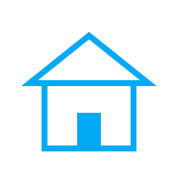
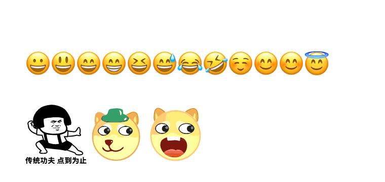
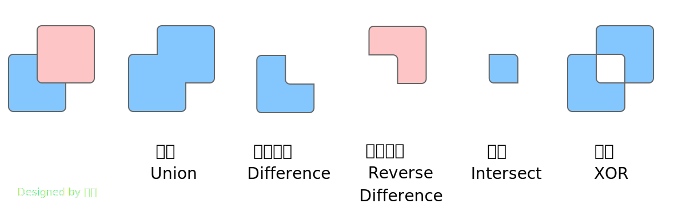
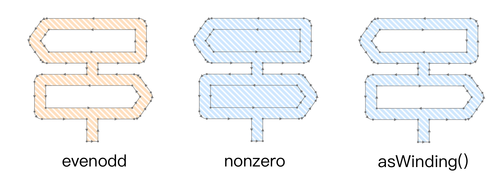
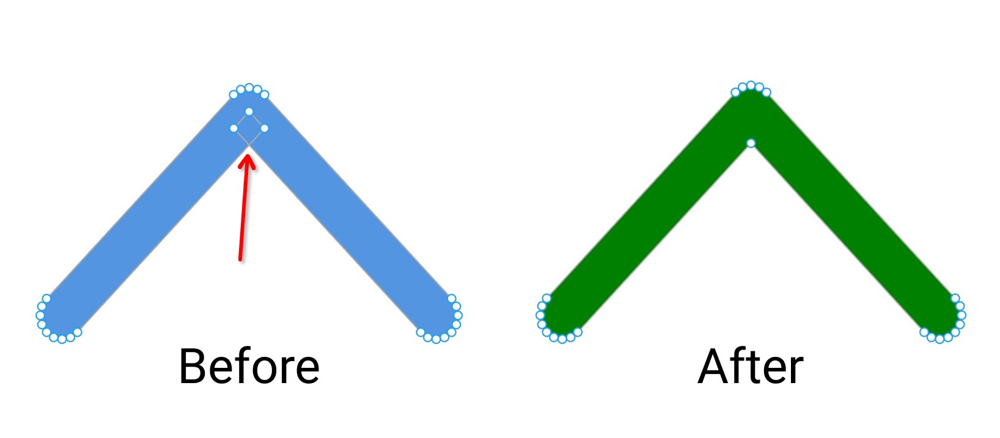
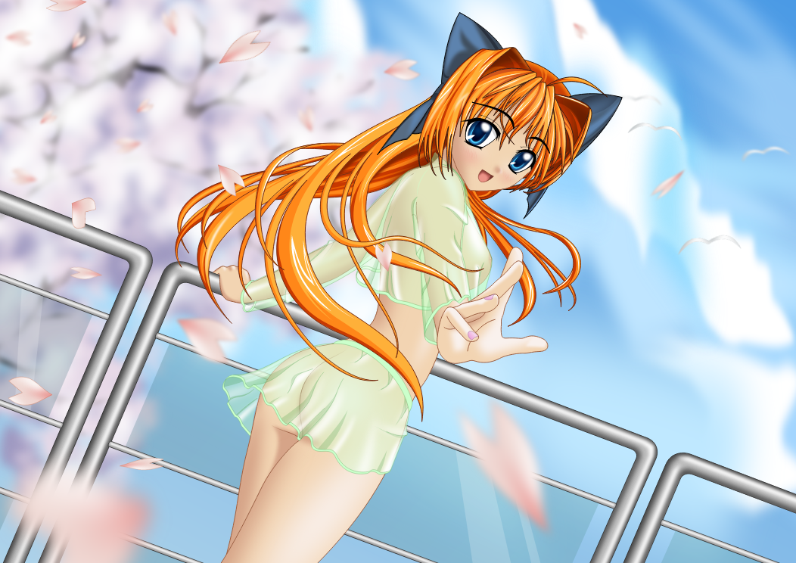

# `skr canvas`

[](https://github.com/Brooooooklyn/canvas/actions/workflows/CI.yaml)

[](https://packagephobia.com/result?p=@napi-rs/canvas)
[](https://npmcharts.com/compare/@napi-rs/canvas?minimal=true)

> 🚀 Help me to become a full-time open-source developer by [sponsoring me on Github](https://github.com/sponsors/Brooooooklyn)

Google Skia binding to Node.js via [Node-API](https://napi.rs), **0 System dependencies!**

⚠️ This project is in pre-release stage. And there may be some bugs.<br/>
For details on planned features and future direction please refer to the [Roadmap](https://github.com/Brooooooklyn/canvas/issues/113).

[中文文档](./README-zh.md)

# Install

```bash
yarn add @napi-rs/canvas
npm install @napi-rs/canvas
```

# Support matrix

## System requirement

### `arm64`

[**_cortex-a57_**](https://en.wikipedia.org/wiki/ARM_Cortex-A57) or newer CPU architecture on **Linux**.

All Apple M chips on **macOS**.

### `armv7`

[**_cortex-a7_**](https://en.wikipedia.org/wiki/ARM_Cortex-A7) or newer CPU architecture.

### glibc

Since Skia relies on the [glibc](https://www.gnu.org/software/libc/) 2.18 API, you need to have at least glibc version >= 2.18 on your system.

## AWS Lambda usage

To use this library on Lambda you will need to use a Lambda layer.

You can simply attach a lambda layer by getting an ARN from [Canvas-Lambda-Layer](https://github.com/ShivamJoker/Canvas-Lambda-Layer)

> Make sure to exclude `@napi-rs/canvas` while bundling your Lambda.

# Usage

```js
const { promises } = require('node:fs')
const { join } = require('node:path')
const { createCanvas, loadImage } = require('@napi-rs/canvas')

const canvas = createCanvas(300, 320)
const ctx = canvas.getContext('2d')

ctx.lineWidth = 10
ctx.strokeStyle = '#03a9f4'
ctx.fillStyle = '#03a9f4'

// Wall
ctx.strokeRect(75, 140, 150, 110)

// Door
ctx.fillRect(130, 190, 40, 60)

// Roof
ctx.beginPath()
ctx.moveTo(50, 140)
ctx.lineTo(150, 60)
ctx.lineTo(250, 140)
ctx.closePath()
ctx.stroke()

async function main() {
  // load images from disk or from a URL
  const catImage = await loadImage('path/to/cat.png')
  const dogImage = await loadImage('https://example.com/path/to/dog.jpg')

  ctx.drawImage(catImage, 0, 0, catImage.width, catImage.height)

  ctx.drawImage(dogImage, canvas.width / 2, canvas.height / 2, dogImage.width, dogImage.height)

  // export canvas as image
  const pngData = await canvas.encode('png') // JPEG, AVIF and WebP are also supported
  // encoding in libuv thread pool, non-blocking
  await promises.writeFile(join(__dirname, 'simple.png'), pngData)
}

main()
```



## Emoji text

```js
const { writeFileSync } = require('fs')
const { join } = require('path')

const { createCanvas, GlobalFonts } = require('@napi-rs/canvas')

GlobalFonts.registerFromPath(join(__dirname, '..', 'fonts', 'AppleColorEmoji@2x.ttf'), 'Apple Emoji')
GlobalFonts.registerFromPath(join(__dirname, '..', '__test__', 'fonts', 'COLRv1.ttf'), 'COLRv1')

console.info(GlobalFonts.families)

const canvas = createCanvas(760, 360)
const ctx = canvas.getContext('2d')

ctx.font = '50px Apple Emoji'
ctx.strokeText('😀😃😄😁😆😅😂🤣☺️😊😊😇', 50, 150)

ctx.font = '100px COLRv1'
ctx.fillText('abc', 50, 300)

const b = canvas.toBuffer('image/png')

writeFileSync(join(__dirname, 'draw-emoji.png'), b)
```



# Performance

See [benchmark](./benchmark) for benchmark code.

Hardware info:

```
                  ,MMMM.           Host        -  xxxxxxxxxxxxxxxxxxxxxxx
                .MMMMMM            Machine     -  Mac15,9
                MMMMM,             Kernel      -  24.0.0
      .;MMMMM:' MMMMMMMMMM;.       OS          -  macOS 15.0.1 Sequoia
    MMMMMMMMMMMMNWMMMMMMMMMMM:     DE          -  Aqua
  .MMMMMMMMMMMMMMMMMMMMMMMMWM.     WM          -  Quartz Compositor
  MMMMMMMMMMMMMMMMMMMMMMMMM.       Packages    -  194 (Homebrew), 32 (cargo)
 ;MMMMMMMMMMMMMMMMMMMMMMMM:        Shell       -  zsh
 :MMMMMMMMMMMMMMMMMMMMMMMM:        Terminal    -  warpterminal (Version v0.2024.10.23.14.49.stable_00)
 .MMMMMMMMMMMMMMMMMMMMMMMMM.       Resolution  -  5120x2880@160fps (as 2560x1440)
  MMMMMMMMMMMMMMMMMMMMMMMMMMM.                    2992x1934@120fps (as 1496x967)
   .MMMMMMMMMMMMMMMMMMMMMMMMMM.                   2232x1512@60fps (as 1116x756)
     MMMMMMMMMMMMMMMMMMMMMMMM      Uptime      -  1d 2h 32m
      ;MMMMMMMMMMMMMMMMMMMM.       CPU         -  Apple M3 Max (16)
        .MMMM,.    .MMMM,.         CPU Load    -  16%
                                   Memory      -  50.1 GB / 134.2 GB
                                   Battery     -  78% & Discharging
                                   Disk Space  -  624.0 GB / 994.7 GB
```

```
❯ yarn bench
Draw a House and export to PNG
┌─────────┬─────────────────┬───────────────────────┬──────────────────────────┬────────────────────────────┬───────────────────────────┬─────────┐
│ (index) │ Task name       │ Latency average (ns)  │ Latency median (ns)      │ Throughput average (ops/s) │ Throughput median (ops/s) │ Samples │
├─────────┼─────────────────┼───────────────────────┼──────────────────────────┼────────────────────────────┼───────────────────────────┼─────────┤
│ 0       │ '@napi-rs/skia' │ '14676992.14 ± 0.68%' │ '14602333.00'            │ '68 ± 0.59%'               │ '68'                      │ 69      │
│ 1       │ 'skia-canvas'   │ '21167809.17 ± 2.05%' │ '20960021.00 ± 13646.00' │ '47 ± 1.31%'               │ '48'                      │ 64      │
│ 2       │ 'node-canvas'   │ '16552027.42 ± 0.70%' │ '16451291.50 ± 2208.50'  │ '60 ± 0.62%'               │ '61'                      │ 64      │
└─────────┴─────────────────┴───────────────────────┴──────────────────────────┴────────────────────────────┴───────────────────────────┴─────────┘
Draw Gradient and export to PNG
┌─────────┬─────────────────┬───────────────────────┬─────────────────────────┬────────────────────────────┬───────────────────────────┬─────────┐
│ (index) │ Task name       │ Latency average (ns)  │ Latency median (ns)     │ Throughput average (ops/s) │ Throughput median (ops/s) │ Samples │
├─────────┼─────────────────┼───────────────────────┼─────────────────────────┼────────────────────────────┼───────────────────────────┼─────────┤
│ 0       │ '@napi-rs/skia' │ '15228495.58 ± 0.53%' │ '15146312.50 ± 1187.50' │ '66 ± 0.48%'               │ '66'                      │ 66      │
│ 1       │ 'skia-canvas'   │ '21725564.41 ± 2.20%' │ '21412520.50 ± 2104.50' │ '46 ± 1.39%'               │ '47'                      │ 64      │
│ 2       │ 'node-canvas'   │ '17976022.14 ± 1.53%' │ '17563479.50 ± 5104.50' │ '56 ± 1.38%'               │ '57'                      │ 64      │
└─────────┴─────────────────┴───────────────────────┴─────────────────────────┴────────────────────────────┴───────────────────────────┴─────────┘
```

# Features

## Path2D

```typescript
new Path2D()
new Path2D(path: Path2D)
// new Path2D('M108.956,403.826c0,0,0.178,3.344-1.276,3.311  c-1.455-0.033-30.507-84.917-66.752-80.957C40.928,326.18,72.326,313.197,108.956,403.826z')
new Path2D(path: string)
```

```typescript
export interface DOMMatrix2DInit {
  a: number
  b: number
  c: number
  d: number
  e: number
  f: number
}

export class Path2D {
  constructor(path?: Path2D | string)

  addPath(path: Path2D, transform?: DOMMatrix2DInit): void
  arc(x: number, y: number, radius: number, startAngle: number, endAngle: number, anticlockwise?: boolean): void
  arcTo(x1: number, y1: number, x2: number, y2: number, radius: number): void
  bezierCurveTo(cp1x: number, cp1y: number, cp2x: number, cp2y: number, x: number, y: number): void
  closePath(): void
  ellipse(
    x: number,
    y: number,
    radiusX: number,
    radiusY: number,
    rotation: number,
    startAngle: number,
    endAngle: number,
    anticlockwise?: boolean,
  ): void
  lineTo(x: number, y: number): void
  moveTo(x: number, y: number): void
  quadraticCurveTo(cpx: number, cpy: number, x: number, y: number): void
  rect(x: number, y: number, w: number, h: number): void

  // PathKit methods
  op(path: Path2D, operation: PathOp): Path2D
  toSVGString(): string
  getFillType(): FillType
  getFillTypeString(): string
  setFillType(type: FillType): void
  simplify(): Path2D
  asWinding(): Path2D
  stroke(stroke?: StrokeOptions): Path2D
  transform(transform: DOMMatrix2DInit): Path2D
  getBounds(): [left: number, top: number, right: number, bottom: number]
  computeTightBounds(): [left: number, top: number, right: number, bottom: number]
  trim(start: number, end: number, isComplement?: boolean): Path2D
  round(radius: number): Path2D
  equals(path: Path2D): boolean
}
```

## PathKit

`PathKit` is a toolset for manipulating Path in `Skia`, supporting **_quadratic beziers_**, **_cubic beziers_** and **_conics_**.
The main features are.

### Path Operation

`.op(path, PathOp)`

```js
const pathOne = new Path2D(
  'M8 50H92C96.4183 50 100 53.5817 100 58V142C100 146.418 96.4183 150 92 150H8C3.58172 150 0 146.418 0 142V58C0 53.5817 3.58172 50 8 50Z',
)
const pathTwo = new Path2D(
  '"M58 0H142C146.418 0 150 3.58172 150 8V92C150 96.4183 146.418 100 142 100H58C53.5817 100 50 96.4183 50 92V8C50 3.58172 53.5817 0 58 0Z',
)

pathOne.op(pathTwo, PathOp.Intersect).toSVGString()
// => "M100 100L58 100C53.5817 100 50 96.4183 50 92L50 50L92 50C96.4183 50 100 53.5817 100 58L100 100Z"
```

- **Union**, subtract the op path from the first path
- **Difference**, intersect the two paths
- **ReverseDifference**, union (inclusive-or) the two paths
- **Intersect**, exclusive-or the two paths
- **XOR**, subtract the first path from the op path



### Covert `FillType` in **_Path_**

`.asWinding()`

You can convert `fill-rule="evenodd"` to `fill-rule="nonzero"` in SVG.
This is useful for **OpenType** font-related tools, as `fill-rule="nonzero"` is only supported in **OpenType** fonts.



```js
const pathCircle = new Path2D(
  'M24.2979 13.6364H129.394V40.9091H24.2979L14.6278 27.2727L24.2979 13.6364ZM21.9592 0C19.0246 0 16.2716 1.42436 14.571 3.82251L1.67756 22.0043C-0.559186 25.1585 -0.559186 29.387 1.67756 32.5411L14.571 50.7227C16.2716 53.1209 19.0246 54.5455 21.9592 54.5455H70.4673V68.1818H16.073C11.0661 68.1818 7.00728 72.2518 7.00728 77.2727V113.636C7.00728 118.657 11.0661 122.727 16.073 122.727H70.4673V150H84.0658V122.727H128.041C130.975 122.727 133.729 121.303 135.429 118.905L148.323 100.723C150.559 97.5686 150.559 93.3405 148.323 90.1864L135.429 72.0045C133.729 69.6064 130.975 68.1818 128.041 68.1818H84.0658V54.5455H133.927C138.934 54.5455 142.993 50.4755 142.993 45.4545V9.09091C142.993 4.07014 138.934 0 133.927 0H21.9592ZM125.702 109.091H20.6058V81.8182H125.702L135.372 95.4545L125.702 109.091Z',
)
pathCircle.setFillType(FillType.EvenOdd)
pathCircle.asWinding().toSVGString()
// => "M24.2979 13.6364L129.394 13.6364L129.394 40.9091L24.2979 40.9091L14.6278 27.2727L24.2979 13.6364ZM21.9592 0C19.0246 0 16.2716 1.42436 14.571 3.82251L1.67756 22.0043C-0.559186 25.1585 -0.559186 29.387 1.67756 32.5411L14.571 50.7227C16.2716 53.1209 19.0246 54.5455 21.9592 54.5455L70.4673 54.5455L70.4673 68.1818L16.073 68.1818C11.0661 68.1818 7.00728 72.2518 7.00728 77.2727L7.00728 113.636C7.00728 118.657 11.0661 122.727 16.073 122.727L70.4673 122.727L70.4673 150L84.0658 150L84.0658 122.727L128.041 122.727C130.975 122.727 133.729 121.303 135.429 118.905L148.323 100.723C150.559 97.5686 150.559 93.3405 148.323 90.1864L135.429 72.0045C133.729 69.6064 130.975 68.1818 128.041 68.1818L84.0658 68.1818L84.0658 54.5455L133.927 54.5455C138.934 54.5455 142.993 50.4755 142.993 45.4545L142.993 9.09091C142.993 4.07014 138.934 0 133.927 0L21.9592 0ZM125.702 109.091L20.6058 109.091L20.6058 81.8182L125.702 81.8182L135.372 95.4545L125.702 109.091Z"
```

### Simplify **_Path_**

`.simplify()`

Set the path to the same non-overlapping contour as the original path area, which means that it can also remove overlapping paths.



[SVG with overlapping paths](./docs/imgs/overlapping-path.svg) (Left)

```js
const path =
  'M2.933,89.89 L89.005,3.818 Q90.412,2.411 92.249,1.65 Q94.087,0.889 96.076,0.889 Q98.065,0.889 99.903,1.65 Q101.741,2.411 103.147,3.818 L189.22,89.89 Q190.626,91.296 191.387,93.134 Q192.148,94.972 192.148,96.961 Q192.148,98.95 191.387,100.788 Q190.626,102.625 189.219,104.032 Q187.813,105.439 185.975,106.2 Q184.138,106.961 182.148,106.961 Q180.159,106.961 178.322,106.2 Q176.484,105.439 175.077,104.032 L89.005,17.96 L96.076,10.889 L103.147,17.96 L17.075,104.032 Q15.668,105.439 13.831,106.2 Q11.993,106.961 10.004,106.961 Q8.015,106.961 6.177,106.2 Q4.339,105.439 2.933,104.032 Q1.526,102.625 0.765,100.788 Q0.004,98.95 0.004,96.961 Q0.004,94.972 0.765,93.134 Q1.526,91.296 2.933,89.89 Z'

path.simplify().toSVGString()
// => "M89.005 3.818L2.933 89.89Q1.526 91.296 0.765 93.134Q0.004 94.972 0.004 96.961Q0.004 98.95 0.765 100.788Q1.526 102.625 2.933 104.032Q4.339 105.439 6.177 106.2Q8.015 106.961 10.004 106.961Q11.993 106.961 13.831 106.2Q15.668 105.439 17.075 104.032L96.076 25.031L175.077 104.032Q176.484 105.439 178.322 106.2Q180.159 106.961 182.148 106.961Q184.138 106.961 185.975 106.2Q187.813 105.439 189.219 104.032Q190.626 102.625 191.387 100.788Q192.148 98.95 192.148 96.961Q192.148 94.972 191.387 93.134Q190.626 91.296 189.22 89.89L103.147 3.818Q101.741 2.411 99.903 1.65Q98.065 0.889 96.076 0.889Q94.087 0.889 92.249 1.65Q90.412 2.411 89.005 3.818Z"
```

## Lottie Animation

Render [Lottie](https://airbnb.io/lottie/) animations using Skia's [Skottie](https://skia.org/docs/user/modules/skottie/) module.

### Load Animation

```js
const { LottieAnimation } = require('@napi-rs/canvas')

// Load from file
const animation = LottieAnimation.loadFromFile('animation.json')

// Load from JSON string with resource path for external assets
const animation = LottieAnimation.loadFromData(jsonString, {
  resourcePath: '/path/to/assets',
})
```

### Animation Properties

```js
animation.duration // Total duration in seconds
animation.fps // Frames per second
animation.frames // Total frame count
animation.width // Animation width
animation.height // Animation height
animation.version // Lottie format version
```

### Playback Control

```js
animation.seekFrame(30) // Seek to frame 30
animation.seek(1.5) // Seek to 1.5 seconds
```

### Render to Canvas

```js
const { createCanvas, LottieAnimation } = require('@napi-rs/canvas')

const animation = LottieAnimation.loadFromFile('animation.json')
const canvas = createCanvas(animation.width, animation.height)
const ctx = canvas.getContext('2d')

// Render at original size
animation.render(ctx)

// Render with custom destination rect
animation.render(ctx, { x: 0, y: 0, width: 800, height: 600 })
```

### Supported Features

- **Embedded images** - Base64-encoded images (`data:image/png;base64,...`)
- **Embedded fonts** - Vector glyph paths for text rendering without system fonts
- **External assets** - Load images from `resourcePath` directory
- **dotLottie format** - Extract `.lottie` ZIP files at runtime (see example)

### Example: Encode Lottie to Video

See [`example/lottie-to-video.ts`](./example/lottie-to-video.ts) for encoding Lottie animations to MP4 using [`@napi-rs/webcodecs`](https://github.com/Brooooooklyn/webcodecs-node).

```js
import { createCanvas, LottieAnimation } from '@napi-rs/canvas'
import {
  VideoEncoder,
  VideoFrame,
  Mp4Muxer,
  type EncodedVideoChunk,
  type EncodedVideoChunkMetadata,
} from '@napi-rs/webcodecs'

const animation = LottieAnimation.loadFromFile('animation.json')
const canvas = createCanvas(animation.width, animation.height)
const ctx = canvas.getContext('2d')

for (let frame = 0; frame < animation.frames; frame++) {
  animation.seekFrame(frame)
  ctx.fillStyle = '#ffffff'
  ctx.fillRect(0, 0, canvas.width, canvas.height)
  animation.render(ctx)
  // Encode frame to video...
}
```

# [Example](./example/tiger.js)

> The tiger.json was serialized from [gojs/samples/tiger](https://github.com/NorthwoodsSoftware/GoJS/blob/master/samples/tiger.html)


```shell
node example/anime-girl.js
```

| SVG                                                                                                                                                                        | PNG                                                                                                                                                                        |
| -------------------------------------------------------------------------------------------------------------------------------------------------------------------------- | -------------------------------------------------------------------------------------------------------------------------------------------------------------------------- |
| <br/>[CC-BY-SA 3.0](https://creativecommons.org/licenses/by/3.0) by [Niabot](https://commons.wikimedia.org/wiki/User:Niabot) | <br/>[CC-BY-SA 3.0](https://creativecommons.org/licenses/by/3.0) by [Niabot](https://commons.wikimedia.org/wiki/User:Niabot) |

# Building

## Build skia from source

You can build this project from source, the system requirements are here: https://skia.org/docs/user/build

```sh
# Clone the code:
$ git clone --recurse-submodules https://github.com/Brooooooklyn/canvas.git
$ cd canvas

# Build Skia:
$ node scripts/build-skia.js

# Install NPM packages, build the Node.js addon:
$ npm install -g yarn
$ yarn install --mode=skip-build # Here are modules that are used for benchmarking and are hard to install, you can skip it by specifying `--mode=skip-build`
$ sudo dnf install clang # https://fedora.pkgs.org/34/fedora-x86_64/clang-12.0.0-0.3.rc1.fc34.x86_64.rpm.html
$ yarn build

# All done! Run test cases or examples now:
$ yarn test
$ node example/tiger.js
```

## Pull pre-build skia binary from GitHub

You can pull skia pre-build binaries if you just care the `Rust` part:

```sh
# Clone the code:
$ git clone --recurse-submodules https://github.com/Brooooooklyn/canvas.git
$ cd canvas

# Download Skia binaries:
# It will pull the binaries match the git hash in `./skia` submodule
$ node scripts/release-skia-binary.mjs --download

# Install NPM packages, build the Node.js addon:
$ npm install -g yarn
$ yarn install --mode=skip-build
$ sudo dnf install clang # https://fedora.pkgs.org/34/fedora-x86_64/clang-12.0.0-0.3.rc1.fc34.x86_64.rpm.html
$ yarn build

# All done! Run test cases or examples now:
$ yarn test
$ node example/tiger.js
```
